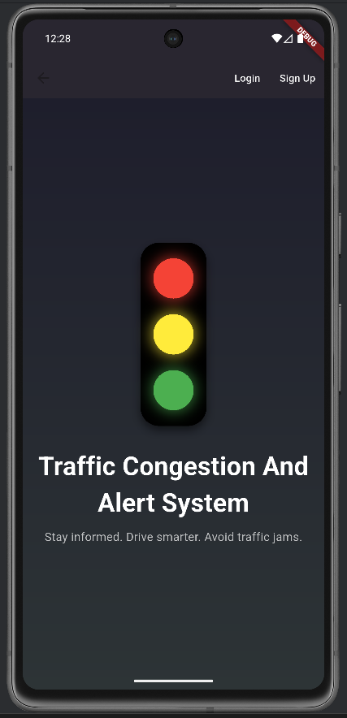
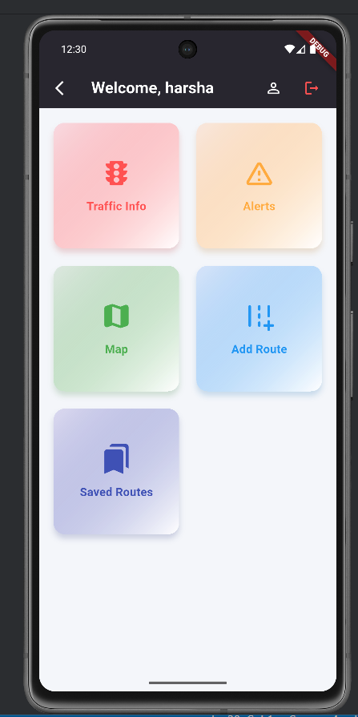
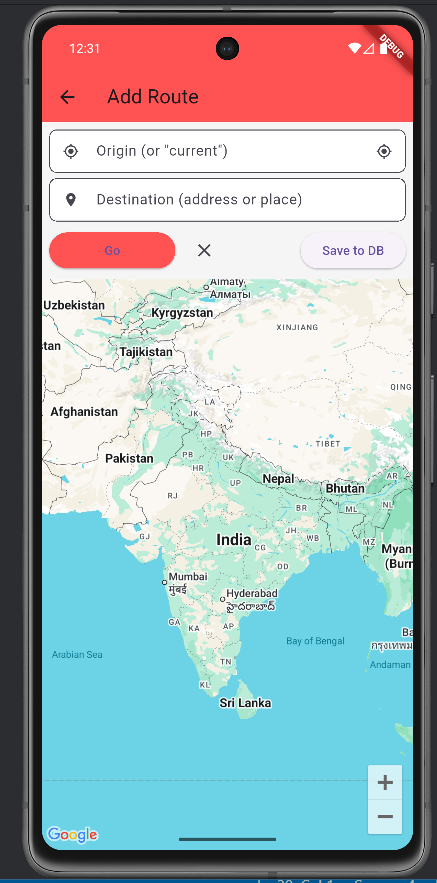
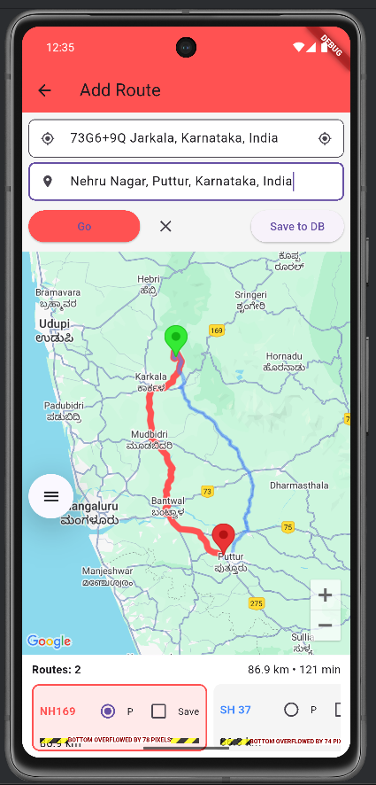
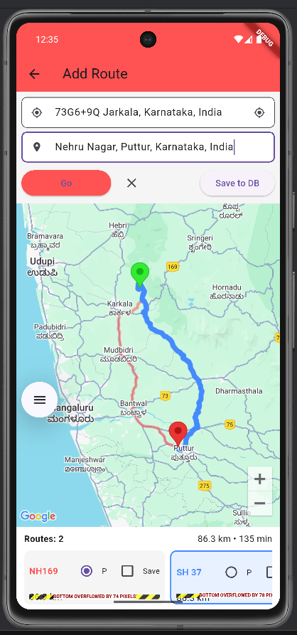
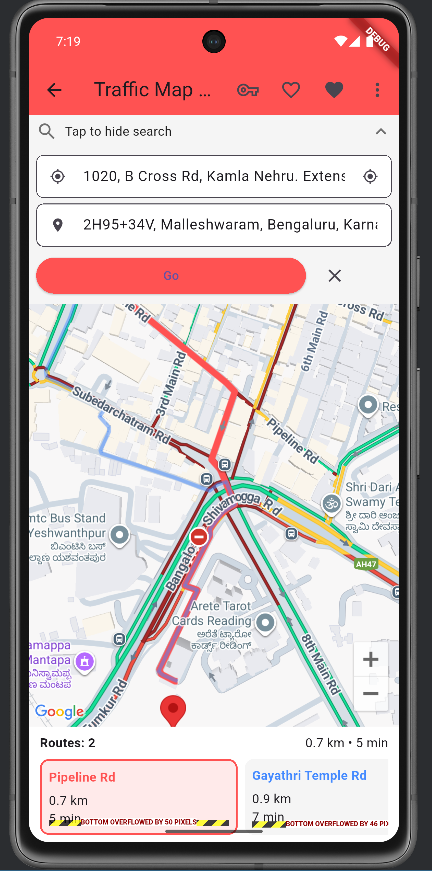
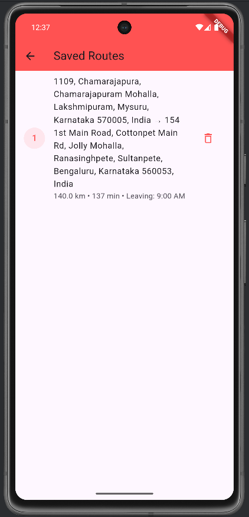

# Traffic-Congestion-Information-and-Alert-System
A Flutter and Django based mobile application that provides traffic congestion monitoring, route optimization, and travel alerts using Google Maps APIs and Firebase Cloud Messaging.

## Features
- ✅ User Authentication
- ✅ Google Maps Integration
- ✅ Route Planning
- ✅ Real-time Traffic Status
- ✅ Alternative Route Suggestions
- ✅ Save Frequently Used Routes
- ✅ Push Notifications
- ✅ User Profile

## Technology Stack
| Technology            | Purpose            |
| --------------------- | ------------------ |
| Flutter               | Mobile Application |
| Django                | Backend API        |
| SQLite                | Database           |
| Firebase              | Push Notifications |
| Google Maps API       | Maps               |
| Google Directions API | Traffic & Routes   |

## Screenshots
### 🏠 Home Screen

The Home Screen serves as the central dashboard of the application after successful login. It provides quick access to core functionalities such as Traffic Information, Alerts, Maps, Route Management, and Saved Routes. The clean and intuitive interface enables users to navigate efficiently between different modules.

### 🔐 Login Screen

The Login Screen allows registered users to securely access their accounts using their credentials. User authentication is handled through the Django backend, ensuring secure access to personalized features such as saved routes and traffic alerts.

### 🚦 Welcome Screen

The Welcome Screen introduces users to the Traffic Congestion and Alert System. It provides a brief overview of the application's purpose. The modern design creates an engaging first impression for new users.

### 🔍 Route Search

The Route Search interface allows users to quickly search for destinations by entering source and destination addresses. The application processes the input and prepares route information for traffic analysis and navigation.

### 🛣️ Route Comparison
           

This screen compares multiple routes between the selected locations using Google Directions API. Users can visualize each route on the map, compare estimated travel times, and select the optimal route based on current traffic conditions.

### 🚗 Live Traffic Analysis

The Live Traffic Analysis screen visualizes real-time traffic conditions on the selected route. Different road colors indicate traffic intensity, helping users identify congested areas and choose faster alternative routes before starting their journey.

### 💾 Saved Routes

The Saved Routes page allows users to view and manage their frequently traveled routes. It displays route details, estimated travel time, and departure schedules, enabling quick access to preferred journeys without entering locations repeatedly.

## Installation

### Backend
  git clone <repo>

  cd backend

  pip install -r requirements.txt

  python manage.py migrate

  python manage.py runserver

### Frontend
  cd frontend

  flutter pub get

  flutter run

## API Endpoints
| Method | Endpoint      | Description       |
| ------ | ------------- | ----------------- |
| POST   | /signup       | User Registration |
| POST   | /login        | User Login        |
| GET    | /routes       | Saved Routes      |
| POST   | /notification | Send Notification |

## Future Improvements
• Live GPS Tracking

• Machine Learning Traffic Prediction

• Voice Navigation

• Offline Maps

• Smart Route Recommendation
